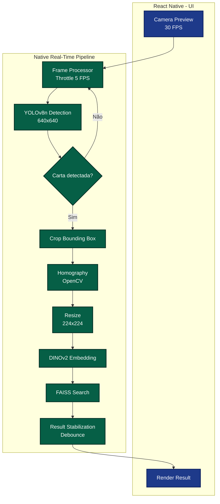

```mermaid
flowchart TD

%% =======================
%% React Native Layer
%% =======================
subgraph RN["React Native - UI"]
    A[Camera Preview<br/>30 FPS]
    K[Render Result]
end

%% =======================
%% Native Real-Time Pipeline
%% =======================
subgraph NATIVE["Native Real-Time Pipeline"]
    
    B[Frame Processor<br/>Throttle 5 FPS]
    
    C[YOLOv8n Detection<br/>640x640]
    
    D{Carta detectada?}
    
    E[Crop Bounding Box]
    
    F[Homography<br/>OpenCV]
    
    G[Resize<br/>224x224]
    
    H[DINOv2 Embedding]
    
    I[FAISS Search]
    
    J[Result Stabilization<br/>Debounce]
end

%% Flow
A --> B
B --> C
C --> D

D -- Não --> B
D -- Sim --> E

E --> F
F --> G
G --> H
H --> I
I --> J
J --> K

%% Styles
classDef rn fill:#1E3A8A,color:#FFFFFF,stroke:#0B1F5B,stroke-width:2px;
classDef native fill:#065F46,color:#FFFFFF,stroke:#022C22,stroke-width:2px;

class A,K rn;
class B,C,D,E,F,G,H,I,J native;
```
